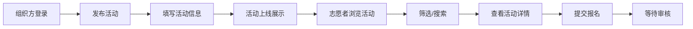
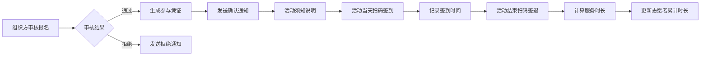
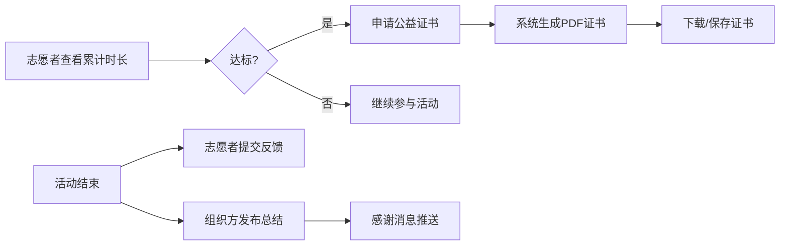

## 1. 产品概述

志愿者活动招募与管理平台是一个连接公益组织与志愿者的综合性服务平台。公益组织可发布招募活动、管理报名、记录签到并生成证书；志愿者可浏览筛选活动、报名参与、查看服务时长并申请公益证书。

- **目标用户**：公益组织（活动发布方）、志愿者（活动参与方）
- **核心价值**：简化志愿者招募流程，数字化管理志愿服务时长，提升公益活动组织效率
- **市场定位**：专注于志愿服务领域的全流程数字化管理平台

## 2. 核心功能

### 2.1 用户角色

| 角色 | 登录方式 | 核心权限 |
|------|----------|----------|
| 志愿者 | 账号登录 | 浏览活动、筛选搜索、报名参与、查看个人记录、申请证书、提交反馈 |
| 公益组织 | 账号登录 | 发布活动、管理报名、审核志愿者、扫码签到签退、发布总结、管理证书 |

### 2.2 功能模块

1. **首页/活动列表页**：活动展示、多维度筛选、搜索功能、活动卡片
2. **活动详情页**：活动信息展示、报名按钮、活动须知、参与凭证
3. **个人中心页**：个人信息、参与记录、累计时长、证书管理、反馈记录
4. **组织方管理页**：活动管理、报名审核、签到管理、活动总结
5. **登录/注册页**：双角色登录、注册功能
6. **证书生成页**：PDF 公益证书生成与下载
7. **签到扫码页**：二维码签到签退功能

### 2.3 页面详情

| 页面名称 | 模块名称 | 功能描述 |
|----------|----------|----------|
| 活动列表页 | 筛选区域 | 城市筛选、类型筛选（环保/教育/助老等）、时间筛选 |
| 活动列表页 | 活动卡片 | 展示活动标题、时间、地点、类型、所需人数、报名状态 |
| 活动详情页 | 活动信息 | 活动介绍、时间地点、人数要求、志愿者要求、主办方信息 |
| 活动详情页 | 报名操作 | 立即报名按钮、取消报名、查看报名状态 |
| 活动详情页 | 参与凭证 | 审核通过后显示二维码凭证、活动须知 |
| 个人中心页 | 数据概览 | 累计服务时长、参与活动数、获得证书数 |
| 个人中心页 | 参与记录 | 历次活动列表、每次活动时长、活动状态 |
| 个人中心页 | 证书管理 | 已获证书列表、申请新证书、下载PDF证书 |
| 个人中心页 | 反馈记录 | 已提交的活动反馈列表 |
| 组织方管理页 | 活动管理 | 创建/编辑/删除活动、查看活动列表 |
| 组织方管理页 | 报名审核 | 查看报名列表、审核通过/拒绝、备注 |
| 组织方管理页 | 签到管理 | 扫码签到、查看签到记录、统计服务时长 |
| 组织方管理页 | 活动总结 | 发布活动总结、感谢消息、上传活动照片 |
| 登录注册页 | 登录表单 | 账号密码登录、角色切换 |
| 登录注册页 | 注册表单 | 志愿者/组织方注册 |

## 3. 核心流程

### 3.1 活动发布与报名流程

公益组织登录后发布活动，填写活动时间、地点、人数和要求。志愿者浏览活动列表，可按城市、类型、时间筛选，找到感兴趣的活动后点击报名，等待组织方审核。

### 3.2 审核与凭证生成流程

组织方审核报名，通过后系统生成参与凭证（含二维码），志愿者收到确认通知和活动须知。活动当天组织方扫码记录签到签退时间，计算有效服务时长。

### 3.3 证书申请与反馈流程

志愿者累计服务时长达到要求后可申请公益证书，系统生成PDF证书。活动结束后志愿者提交反馈评价，组织方发布活动总结和感谢消息。

## 4. 用户界面设计

### 4.1 设计风格

- **主色调**：温暖的绿色系（代表希望、公益、生命力），主色 #10B981（翡翠绿）
- **辅助色**：暖橙色 #F59E0B（代表热情、阳光），用于强调和CTA按钮
- **中性色**：以 slate/gray 为基础，确保可读性和专业感
- **设计风格**：温暖友好、简洁现代、卡片式布局、柔和圆角、清新有活力
- **按钮风格**：圆润胶囊型按钮，带有微妙的悬停动效和阴影
- **字体**：中文使用"PingFang SC" / "Microsoft YaHei"，数字和英文使用 "Inter" 或 "Poppins"
- **图标风格**：线性图标，统一使用 lucide-react 图标库
- **整体氛围**：温暖、信任、积极向上，体现公益事业的正能量

### 4.2 页面设计概览

| 页面名称 | 模块名称 | UI 元素 |
|----------|----------|---------|
| 活动列表页 | Hero区域 | 渐变背景、大标题、搜索框、简洁有力的标语 |
| 活动列表页 | 筛选栏 | 横向排列的筛选标签、城市选择下拉、日期选择器 |
| 活动列表页 | 活动卡片 | 卡片式布局、类型标签、时间地点图标、报名进度条、悬停微动效 |
| 活动详情页 | 头部横幅 | 活动大图/渐变背景、活动标题、状态标签、返回按钮 |
| 活动详情页 | 信息区 | 图标+文字的信息条、活动介绍长文本、要求列表 |
| 活动详情页 | 报名区 | 醒目CTA按钮、报名人数显示、状态提示 |
| 活动详情页 | 凭证区 | 卡片式凭证、二维码居中、活动信息环绕、微光效果 |
| 个人中心页 | 数据看板 | 三个数据卡片并排、数字放大展示、渐变色块 |
| 个人中心页 | 记录列表 | 时间线式布局、活动状态标签、时长显示 |
| 组织方管理页 | 侧边导航 | 垂直导航栏、图标+文字、选中高亮 |
| 组织方管理页 | 数据表格 | 简洁的数据表格、操作按钮、状态标签 |
| 登录注册页 | 页面布局 | 左右分栏、左侧品牌展示区、右侧表单区、渐变背景 |

### 4.3 响应式设计

- **设计原则**：桌面优先设计，向下适配平板和移动端
- **断点设置**：sm (640px)、md (768px)、lg (1024px)、xl (1280px)
- **移动端适配**：导航转为底部标签栏、筛选栏可横向滚动、卡片改为单列布局
- **触摸优化**：按钮最小尺寸 44x44px、增加点击区域、避免hover依赖

### 4.4 动效与交互

- **页面过渡**：淡入+轻微上移的入场动画
- **卡片悬停**：轻微上浮 + 阴影增强 + 边框高亮
- **按钮交互**：点击时有缩放反馈，悬停时颜色加深
- **状态变化**：报名成功、审核通过等关键节点有动画反馈
- **加载状态**：骨架屏或脉冲动画，避免空白感
- **二维码展示**：微光呼吸效果，突出凭证的重要性
