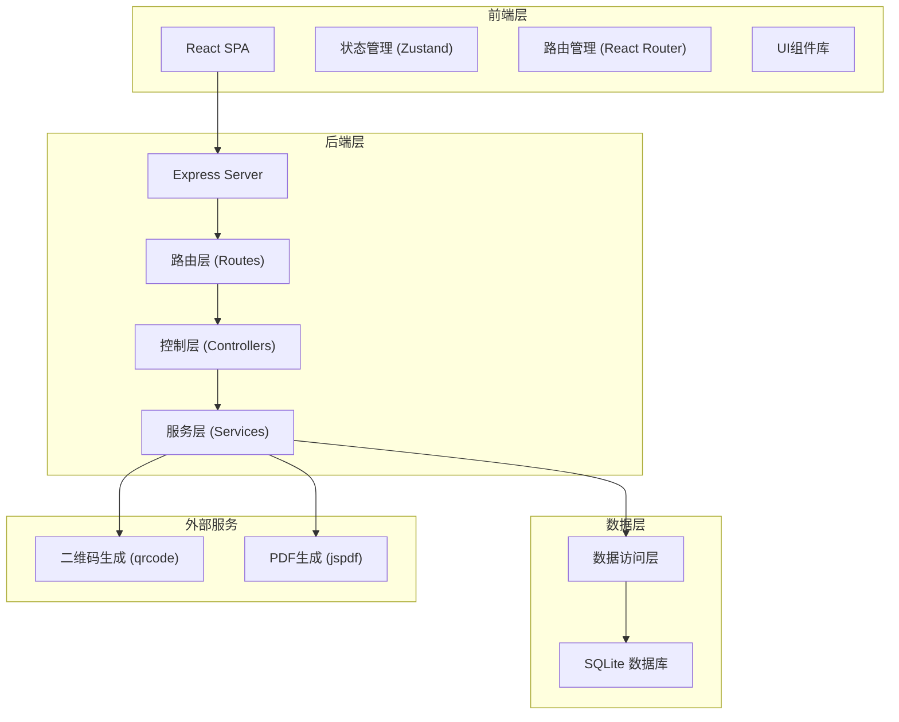
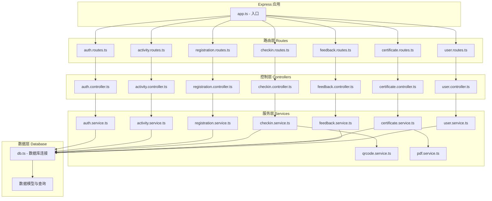
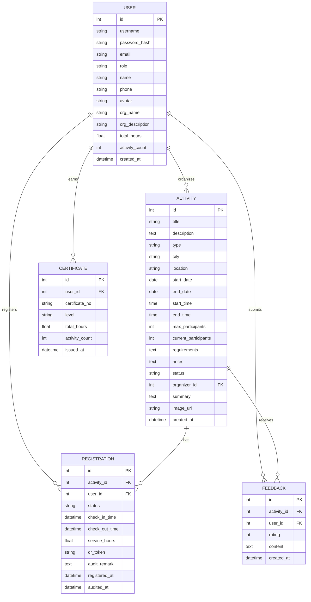

## 1. 架构设计

本项目采用前后端分离架构，前端使用 React + TypeScript + Vite 构建，后端使用 Express + TypeScript 提供 API 服务，数据存储采用 SQLite 轻量级数据库（便于开发和演示）。整体采用三层架构设计，确保代码的可维护性和可扩展性。



## 2. 技术描述

- **前端技术栈**：
  - 框架：React@18 + TypeScript
  - 构建工具：Vite@5
  - 路由：react-router-dom@6
  - 状态管理：zustand@4
  - UI样式：Tailwind CSS@3
  - 图标库：lucide-react
  - 二维码显示：qrcode.react（前端显示用）

- **后端技术栈**：
  - 框架：Express@4 + TypeScript
  - 数据库：SQLite + better-sqlite3
  - 二维码生成：qrcode
  - PDF生成：jspdf
  - 密码加密：bcryptjs
  - 身份认证：JWT (jsonwebtoken)
  - CORS：cors 中间件

- **初始化方式**：使用 vite-init 的 react-express-ts 模板

## 3. 路由定义

### 前端路由

| 路由路径 | 页面名称 | 说明 |
|----------|----------|------|
| `/` | 活动列表页（首页） | 展示所有活动，支持筛选和搜索 |
| `/activity/:id` | 活动详情页 | 活动详情展示、报名、凭证 |
| `/login` | 登录页 | 志愿者/组织方登录 |
| `/register` | 注册页 | 志愿者/组织方注册 |
| `/profile` | 个人中心 | 志愿者个人信息、参与记录、证书 |
| `/org/dashboard` | 组织方控制台 | 组织方管理首页概览 |
| `/org/activities` | 活动管理 | 组织方活动列表、创建/编辑 |
| `/org/activity/:id/registrations` | 报名管理 | 审核报名、查看报名列表 |
| `/org/activity/:id/checkin` | 签到管理 | 扫码签到签退 |
| `/certificate/:id` | 证书预览 | PDF证书预览和下载 |

### 后端 API 路由

| 方法 | 路由路径 | 功能说明 |
|------|----------|----------|
| POST | `/api/auth/login` | 用户登录 |
| POST | `/api/auth/register` | 用户注册 |
| GET | `/api/activities` | 获取活动列表（支持筛选） |
| GET | `/api/activities/:id` | 获取活动详情 |
| POST | `/api/activities` | 创建活动（组织方） |
| PUT | `/api/activities/:id` | 更新活动（组织方） |
| DELETE | `/api/activities/:id` | 删除活动（组织方） |
| POST | `/api/activities/:id/register` | 报名活动 |
| GET | `/api/activities/:id/registrations` | 获取报名列表（组织方） |
| PUT | `/api/registrations/:id/audit` | 审核报名（组织方） |
| POST | `/api/checkin` | 扫码签到签退 |
| GET | `/api/user/registrations` | 获取我的报名记录 |
| GET | `/api/user/stats` | 获取用户统计数据 |
| GET | `/api/user/certificates` | 获取用户证书列表 |
| POST | `/api/certificates/apply` | 申请证书 |
| GET | `/api/certificates/:id` | 获取证书详情 |
| GET | `/api/certificates/:id/pdf` | 生成并下载PDF证书 |
| POST | `/api/feedback` | 提交活动反馈 |
| GET | `/api/activities/:id/feedback` | 获取活动反馈列表 |
| POST | `/api/activities/:id/summary` | 发布活动总结（组织方） |

## 4. API 接口定义

### 类型定义

```typescript
// 用户类型
type UserRole = 'volunteer' | 'organization';

interface User {
  id: number;
  username: string;
  email: string;
  role: UserRole;
  name: string;
  phone?: string;
  avatar?: string;
  createdAt: string;
  // 志愿者字段
  totalHours?: number;
  activityCount?: number;
  // 组织方字段
  orgName?: string;
  orgDescription?: string;
}

// 活动类型
type ActivityType = 'environment' | 'education' | 'elderly' | 'community' | 'animal' | 'other';
type ActivityStatus = 'draft' | 'published' | 'ongoing' | 'completed';

interface Activity {
  id: number;
  title: string;
  description: string;
  type: ActivityType;
  city: string;
  location: string;
  startDate: string;
  endDate: string;
  startTime: string;
  endTime: string;
  maxParticipants: number;
  currentParticipants: number;
  requirements: string;
  notes?: string;
  status: ActivityStatus;
  organizerId: number;
  organizerName: string;
  summary?: string;
  createdAt: string;
  imageUrl?: string;
}

// 报名记录
type RegistrationStatus = 'pending' | 'approved' | 'rejected' | 'cancelled' | 'completed';

interface Registration {
  id: number;
  activityId: number;
  userId: number;
  userName: string;
  userPhone?: string;
  status: RegistrationStatus;
  checkInTime?: string;
  checkOutTime?: string;
  serviceHours?: number;
  qrCode?: string;
  auditRemark?: string;
  registeredAt: string;
  auditedAt?: string;
}

// 证书
interface Certificate {
  id: number;
  userId: number;
  userName: string;
  certificateNo: string;
  level: string;
  totalHours: number;
  activityCount: number;
  issuedAt: string;
  pdfUrl?: string;
}

// 反馈
interface Feedback {
  id: number;
  activityId: number;
  userId: number;
  userName: string;
  rating: number;
  content: string;
  createdAt: string;
}
```

## 5. 服务端架构图



## 6. 数据模型

### 6.1 ER图



### 6.2 数据库初始化 SQL

```sql
-- 用户表
CREATE TABLE IF NOT EXISTS users (
  id INTEGER PRIMARY KEY AUTOINCREMENT,
  username VARCHAR(50) UNIQUE NOT NULL,
  password_hash VARCHAR(255) NOT NULL,
  email VARCHAR(100) UNIQUE NOT NULL,
  role VARCHAR(20) NOT NULL CHECK (role IN ('volunteer', 'organization')),
  name VARCHAR(100) NOT NULL,
  phone VARCHAR(20),
  avatar VARCHAR(255),
  org_name VARCHAR(100),
  org_description TEXT,
  total_hours DECIMAL(10, 2) DEFAULT 0,
  activity_count INTEGER DEFAULT 0,
  created_at DATETIME DEFAULT CURRENT_TIMESTAMP
);

-- 活动表
CREATE TABLE IF NOT EXISTS activities (
  id INTEGER PRIMARY KEY AUTOINCREMENT,
  title VARCHAR(200) NOT NULL,
  description TEXT NOT NULL,
  type VARCHAR(50) NOT NULL,
  city VARCHAR(50) NOT NULL,
  location VARCHAR(200) NOT NULL,
  start_date DATE NOT NULL,
  end_date DATE NOT NULL,
  start_time TIME NOT NULL,
  end_time TIME NOT NULL,
  max_participants INTEGER NOT NULL,
  current_participants INTEGER DEFAULT 0,
  requirements TEXT,
  notes TEXT,
  status VARCHAR(20) DEFAULT 'published' CHECK (status IN ('draft', 'published', 'ongoing', 'completed')),
  organizer_id INTEGER NOT NULL,
  summary TEXT,
  image_url VARCHAR(255),
  created_at DATETIME DEFAULT CURRENT_TIMESTAMP,
  FOREIGN KEY (organizer_id) REFERENCES users(id)
);

-- 报名表
CREATE TABLE IF NOT EXISTS registrations (
  id INTEGER PRIMARY KEY AUTOINCREMENT,
  activity_id INTEGER NOT NULL,
  user_id INTEGER NOT NULL,
  status VARCHAR(20) DEFAULT 'pending' CHECK (status IN ('pending', 'approved', 'rejected', 'cancelled', 'completed')),
  check_in_time DATETIME,
  check_out_time DATETIME,
  service_hours DECIMAL(10, 2) DEFAULT 0,
  qr_token VARCHAR(100) UNIQUE,
  audit_remark TEXT,
  registered_at DATETIME DEFAULT CURRENT_TIMESTAMP,
  audited_at DATETIME,
  FOREIGN KEY (activity_id) REFERENCES activities(id),
  FOREIGN KEY (user_id) REFERENCES users(id),
  UNIQUE(activity_id, user_id)
);

-- 证书表
CREATE TABLE IF NOT EXISTS certificates (
  id INTEGER PRIMARY KEY AUTOINCREMENT,
  user_id INTEGER NOT NULL,
  certificate_no VARCHAR(50) UNIQUE NOT NULL,
  level VARCHAR(50) NOT NULL,
  total_hours DECIMAL(10, 2) NOT NULL,
  activity_count INTEGER NOT NULL,
  issued_at DATETIME DEFAULT CURRENT_TIMESTAMP,
  FOREIGN KEY (user_id) REFERENCES users(id)
);

-- 反馈表
CREATE TABLE IF NOT EXISTS feedback (
  id INTEGER PRIMARY KEY AUTOINCREMENT,
  activity_id INTEGER NOT NULL,
  user_id INTEGER NOT NULL,
  rating INTEGER NOT NULL CHECK (rating BETWEEN 1 AND 5),
  content TEXT NOT NULL,
  created_at DATETIME DEFAULT CURRENT_TIMESTAMP,
  FOREIGN KEY (activity_id) REFERENCES activities(id),
  FOREIGN KEY (user_id) REFERENCES users(id)
);

-- 索引
CREATE INDEX IF NOT EXISTS idx_activities_city ON activities(city);
CREATE INDEX IF NOT EXISTS idx_activities_type ON activities(type);
CREATE INDEX IF NOT EXISTS idx_activities_status ON activities(status);
CREATE INDEX IF NOT EXISTS idx_activities_date ON activities(start_date);
CREATE INDEX IF NOT EXISTS idx_registrations_user ON registrations(user_id);
CREATE INDEX IF NOT EXISTS idx_registrations_activity ON registrations(activity_id);
CREATE INDEX IF NOT EXISTS idx_registrations_status ON registrations(status);
CREATE INDEX IF NOT EXISTS idx_certificates_user ON certificates(user_id);
```
